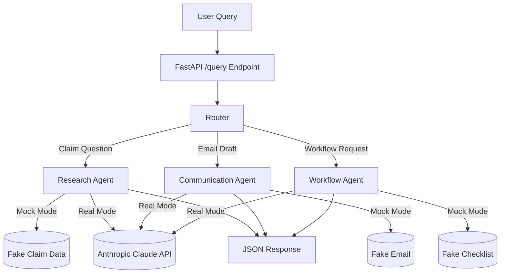

# AI Claims Research Agent


A modular, multi-agent system designed to analyze healthcare claims, explain benefit rules, draft communications, and automate operational workflows.
Built with **Anthropic Claude**, **FastAPI**, and a clean, extensible architecture.

---

## 🚀 About This Project

Healthcare operations are full of friction — messy claim questions, unclear denial reasons, manual research steps, and communication loops that slow everything down. After years working inside PBM and payer environments, I saw the same pattern repeat: smart people spending too much time on repetitive, low-leverage tasks.

The AI Claims Research Agent is a prototype of the internal tool I always wished existed — something that could:

- Read a confusing claim question
- Reason through benefit rules
- Generate a clear explanation
- Outline next steps for a human reviewer

It blends domain expertise, LLM reasoning, and production-grade backend design into a system that feels practical, testable, and ready to extend.

---

## ✨ Features

### 🧠 Multi-Agent Architecture

- **Research Agent** — interprets claim questions, generates SQL, and returns structured JSON.
- **Communication Agent** — drafts emails, explanations, and summaries in plain language.
- **Workflow Agent** — creates checklists, step-by-step processes, and operational workflows.

### 🔌 API Layer (FastAPI)

- `/query` endpoint routes requests to the correct agent.
- Typed request/response models using Pydantic.
- Easy to integrate with dashboards, UIs, or automation tools.

### 🗂️ Clean Project Structure

```
ai-claims-research-agent/
│
├── src/
│   ├── agents/
│   │   ├── research_agent.py
│   │   ├── communication_agent.py
│   │   └── workflow_agent.py
│   ├── router/
│   │   └── agent_router.py
│   ├── prompts/
│   │   ├── research_prompt.md
│   │   ├── communication_prompt.md
│   │   └── workflow_prompt.md
│   ├── models/
│   │   ├── request_models.py
│   │   └── response_models.py
│   └── main.py
│
├── demo.py
├── requirements.txt
├── .env.example
└── README.md
```

---

## 🧪 Mock Mode (No API Key Required)

This project includes a **Mock Mode** that allows anyone to run the system without:

- an Anthropic API key
- a database
- external dependencies

Mock Mode returns **realistic fake outputs** for all three agents (Research, Communication, Workflow). This makes the project fully runnable for demos, interviews, and portfolio reviewers.

**Enable Mock Mode**

```bash
MOCK_MODE=true
```

---

## 🛠️ Tech Stack

**Languages & Runtime**
- Python 3.10+

**AI & LLM**
- Anthropic Claude (Opus / Sonnet)

**Backend Framework**
- FastAPI
- Pydantic (typed request/response models)

**Architecture**
- Modular multi-agent system
- Router-based agent selection
- Prompt templates stored in Markdown
- Mock Mode for offline development

**Tooling**
- Uvicorn (local server)
- Pytest (unit tests)
- GitHub (version control)

---

## 📐 System Architecture



---

## ⚙️ Setup

### Prerequisites

- Python 3.10+
- Anthropic API key *(or use Mock Mode — no key needed)*

### Install

```bash
git clone https://github.com/YOUR_USERNAME/ai-claims-research-agent.git
cd ai-claims-research-agent
python -m venv .venv && source .venv/bin/activate
pip install -r requirements.txt
cp .env.example .env
```

### Configure `.env`

```
ANTHROPIC_API_KEY=sk-ant-your-key-here
MOCK_MODE=false
```

### Run

```bash
uvicorn src.main:app --reload
```

Open `http://localhost:8000/docs` for the interactive API docs.

---

## 📄 License

MIT License — see [LICENSE](LICENSE) for details.
